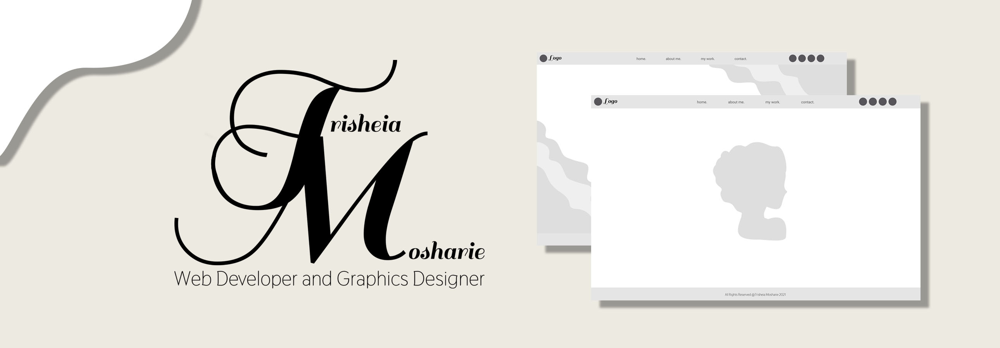

## Who Am I?
My name is Trisheia from Buffalo, NY, and I am a Web Developer and Graphics Designer. Passionate about creating beautifully minimal website designs with user-friendly interfaces. I am always enthusiastic about new opportunities and excelling in my career. Feel free to check out my most recent graphics work when I upload it here on **[Dribbble](http://dribbble.com)**.

I create Wireframes, Mockups, and Prototypes using  Figma to map out my project designs. 

**My favorite coding languages so far...**
 
HTML 
CSS

**I am currently learning...**
 
JavaScript

**Frameworks**
 
React
jQuery

